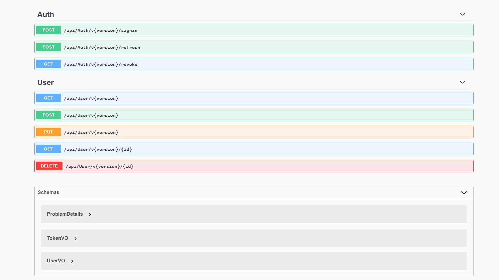

<a><h1 align="center">ASP .NET 5 Rest API</h1></a>

  

  This project helped me to not only practice .NET but also new concepts and technologies.

  

     
     
    
  

  

   <a href="https://github.com/rafaelfaustini/rest-api/issues/new?assignees=rafaelfaustini&labels=Documentation%2C+Translation&template=new-language-request.md&title=%5Btranslation%5D">Request language</a>
     ·
    <a href="https://github.com/rafaelfaustini/rest-api/issues/new?assignees=&labels=Bug+Fix&template=bug_report.md&title=%5Bbugfix%5D">Report a bug</a>
     ·
    <a href="https://github.com/rafaelfaustini/rest-api/issues/new?assignees=&labels=feature&template=feature_request.md&title=%5Bfeature%5D">Have an idea ?</a>
  

  

    ·
    <a href="/docs/readme_pt-BR.md">Português Brasileiro</a>
    .
  

# Concepts and Technologies

## .NET 5.0

 
The api was made with .NET 5.0 released in 2021.

## Endpoints Versioning

Microsoft's [ASP.NET API Versioning](https://github.com/microsoft/aspnet-api-versioning) allows the API to have controllers versions, it is very useful to update the API without breaking the client applications, by running multiple versions of the endpoints at the same time.

## Generic Repositories

The generic repositories approach makes easy the creation of simple CRUD repositories. For more specific implementations such as the auth, a custom interface was created with the methods to be implemented.

## Database Context

Besides making operations easier without the necessity of writing SQL for simple logics, with database context it's easier to change the DBMS used, for now MySQL is used but can be easily replaced.

## Migrations

Versioning databases is a big challenge and migrations are there to help with that, the [Evolve](https://evolve-db.netlify.app/) tool was used.

## Value Object

With value object it is possible to change the way data is inputted and outputted to the client, without changing the model. A display name stored in the database as first name and last name, could be a single attribute in the VO.

## Content Negotiation

Not all clients will be able to parse json, so the Content Negotiation mechanic was applied, based on the request header the client and server can communicate it's input/output with XML/JSON using the same URI.

## Authentication

Using [JWT](https://jwt.io/), the login and password authentication (comparing hashes and generating tokens) gave the api some security agaisn't not allowed clients.

## Docker

Setting up the development environment can be a tremendous time waste for developers, by having a docker image and the project files it is way easier to set up the environment/deploy the application. So the images for the [API enviromnent](https://hub.docker.com/repository/docker/rafaelfaustini/rest-api) and the [MySQL's Database enviroment](https://hub.docker.com/repository/docker/rafaelfaustini/rest-api-db) is available in the docker hub by clicking on it's respective names.

## Travis CI

Travis CI was used to automate the docker image upload on the DockerHub, but it can be also used to run unit tests for the application.

## Swagger

 
[Swagger](https://swagger.io/) is an awesome tool to help documenting the api in an easier way, it is integrated with the project. It shows the routes, the possible response HTTP Codes and also gives the possibility to test the API using it's own interface.

# Application Setup

Make sure you have docker installed and run the following commands in the powershell/bash  
`
docker run -p 1434:1433 --name <ContainerName> rafaelfaustini/rest-api
`
  and  
`
docker run -p 1434:1433 --name <ContainerName> rafaelfaustini/rest-api-db
`
 

In this command you can replace the `1434` with the port you want to run and also name the container as you like by changing `<ContainerName>` to the name you wish.

With the containers running, access you can easily access with your browser
http://localhost:44399
If it opens the swagger screen, the API is ready to go.

# Contribute

If you find any issues, have any suggestion or want to help translating the documentation, feel free to create issues and pull requests.
