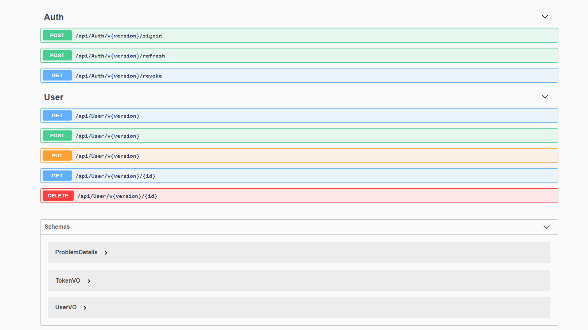

<a><h1 align="center">ASP .NET 5 Rest API</h1></a>

  <p align="center">
  Esse projeto me ajudou não à apenas praticar .NET mas também novos conceitos e tecnologias

  <p align="center">
     <a href="https://github.com/rafaelfaustini/rest-api/issues">
      
    </a>
     <a href="https://github.com/rafaelfaustini/rest-api/pulls">
      
    </a>
    <a href="https://travis-ci.org/rafaelfaustini/rest-api"></a>
  </p>
  <p align="center">
   <a href="https://github.com/rafaelfaustini/rest-api/issues/new?assignees=rafaelfaustini&labels=Documentation%2C+Translation&template=new-language-request.md&title=%5Btranslation%5D">Solicitar idioma</a>
     ·
    <a href="https://github.com/rafaelfaustini/rest-api/issues/new?assignees=&labels=Bug+Fix&template=bug_report.md&title=%5Bbugfix%5D">Reportar um bug</a>
     ·
    <a href="https://github.com/rafaelfaustini/rest-api/issues/new?assignees=&labels=feature&template=feature_request.md&title=%5Bfeature%5D">Teve uma ideia ?</a>
  </p>
  <p align="center">
    ·
    <a href="../README.md">English</a>
    .
  </p>

# Concepts and Technologies

## .NET 5.0

<br>
A api foi feita com .NET 5.0 lançada em 2021.

## Versionamento de Endpoints

[ASP.NET API Versioning](https://github.com/microsoft/aspnet-api-versioning) da Microsoft possibilita que a API possua versões de controllers, é muito útil para atualizar a API sem quebrar aplicações cliente, por rodar multiplas versões de endpoints ao mesmo tempo.

## Repositórios Genéricos

A abordagem com repositórios genéricos torna fácil a criação de repositórios de CRUD simples. Para implementações mais específicas como a de autenticação, uma interface personalizada foi criada com os métodos a serem implementados.

## Contextos de Banco de Dados

Além de tornar as operações mais fáceis sem a necessidade de escrever SQL para lógicas simples, com contextos de bancos de dados é mais simples trocar o SGBD usado, por enquanto MySQL é usado mas pode fácilmente ser substituido.

## Migrations

Versionamento de banco de dados é um grande desafio e as migrations estão aqui para ajudar com isso, a ferramenta [Evolve](https://evolve-db.netlify.app/) foi usada.

## Value Object

Com value object é possível modificar a forma que dados são inputados e outputados ao cliente, sem trocar a model. Um nome pode ser armazenado na base de dados como nome e sobrenome e no VO ser um único atributo.

## Content Negotiation

Nem todos os clientes serão capazes de entender json, então a mecânica de Content Negotiation foi aplicada, baseado no header da requisição o cliente e o server podem comunicar seus input/output com XML/JSON utilizando a mesma URI.

## Authentication

Usando [JWT](https://jwt.io/), a autenticação de login e senha (comparação de hashes e geração de tokens) deu a api alguma segurança contra clientes não autorizados.

## Docker

Configurar um ambiente de desenvolvimento pode ser uma tremenda perda de tempo para desenvolvedores, ao ter uma imagem docker e os arquivos do projeto é bem mais fácil de configurar o ambiente/fazer deploy da aplicação. Então imagens para o [ambiente da API](https://hub.docker.com/repository/docker/rafaelfaustini/rest-api) e o [ambiente do banco de dados MySQL](https://hub.docker.com/repository/docker/rafaelfaustini/rest-api-db) está disponível no docker hub ao simplesmente clicar em seus respectivos nomes.

## Travis CI

Travis CI foi utilizado para automatizar o upload da imagem docker no DockerHub, mas também pode ser usado para rodar testes unitários para a aplicação.

## Swagger

<br>
[Swagger](https://swagger.io/) é uma incrível ferramenta para ajudar a documentar a api de uma forma fácil, é integrada ao projeto. Mostra as rotas, as possíveis respostas em HTTP code e também dá a possibilidade de testar a API usando sua própria interface.

# Setup da aplicação

Primeiro faça o pull das imagens do docker hub simplesmente rodando no terminal (Precisa do docker instalado)

```
docker pull rafaelfaustini/rest-api-db
docker pull rafaelfaustini/rest-api
```

Com os containers rodado, você pode facilmente acessar com seu browser
http://localhost:44399
Se abrir a tela do swagger, a api já está preparada.

# Contribuição

Se você encontrar algum problema, tiver uma sugestão ou quiser ajudar a traduzir essa documentação, sinta-se livre para criar issues e pull requests.
